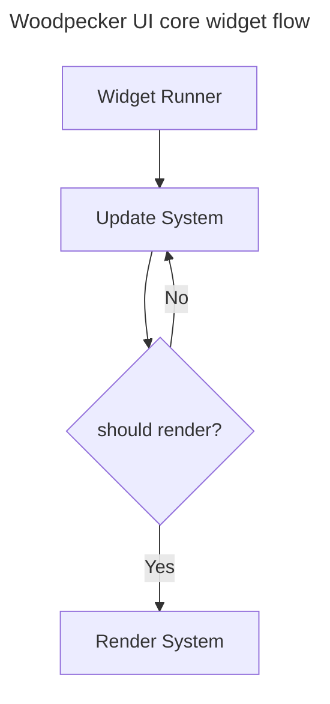
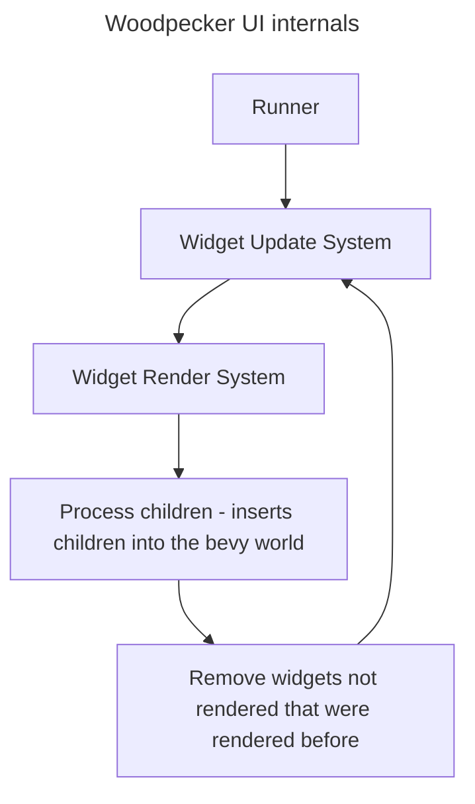
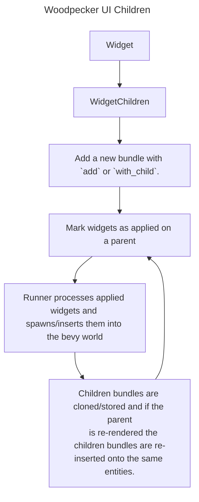

# Woodpecker UI Book

- [Woodpecker UI Book](#woodpecker-ui-book)
  - [Widget flow](#widget-flow)
    - [Widget](#widget)
    - [Update System](#update-system)
    - [Render System](#render-system)
    - [Understanding Widget Children](#understanding-widget-children)
  - [Widget State](#widget-state)
    - [Defining state](#defining-state)
  - [Understanding the macro](#understanding-the-macro)
  - [Widget Events](#widget-events)
  - [Understanding Woodpecker UI's internals](#understanding-woodpecker-uis-internals)


## Widget flow
In Woodpecker UI the widgets flow is very important to learn to avoid possible footguns due to how the UI is built in the ECS. The core user facing flow looks like:



Note: The actual internals look a little different. Widget update only happens *once* per frame.

### Widget
A widget is described as any bevy entity which implements the `Widget` trait and has two systems. A widget can also be described as a bundle or collection of components that include a widget with the `Widget` trait. Widgets have hierarchy through bevy's parent/child relationships. Widgets can have state and context which are explained later in the book.

### Update System
The update system controls the flow of the widget. It is a regular bevy system that returns a boolean that represents if the widget should re-render. Update systems can automatically be generated by using the proc macro attributes:

```rust
#[derive(Widget, Component, Default, PartialEq, Clone)]
#[auto_update(render)] // The render system
#[props(MyWidget)]
pub struct MyWidget;
```

The `auto_update` attribute tells the macro that an update system should be automatically generated and the `props` attribute tells the macro which bevy Components to diff against using PartialEq. The widget will re-render if any of these change. The `props` can also define multiple components like: `#[props(MyWidget, MyComponent, WoodpeckerStyle)]`. There are also other attributes for diffing against state and context, but we'll cover those later. Update systems can also be manually described by using the `#[widget_systems(update, render)]` macro attribute however its generally better to use `auto_update`.

### Render System
Render systems do not describe the way a widget is drawn instead they describe changes to the widget's structure or its own sub tree. They can describe extremely complex behavior or very simple behavior for a given widget. Lets take a look at a simple example first:

```rust
// Render systems are **bevy systems**
// You can query data as expected but in this example we care about two things:
// Res<CurrentWidget> - A bevy resource that is inserted for each instance of the widget rendering.
// Query<&mut WidgetChildren> - A query to get and mutate the widget's children.
fn render(current_widget: Res<CurrentWidget>, mut query: Query<&mut WidgetChildren>) {
    // Standard bevy syntax to pull data from the query.
    // Note: The current widget is a bevy entity! It is wrapped to pass into the system.
    // but we can deref it to get the entity. Internally it looks like: CurrentWidget(pub Entity). 
    let Ok(mut children) = query.get_mut(**current_widget) else {
        return;
    };

    // Here we mutate the children by telling them to apply to this widget(which is a parent).
    // ParentWidget is another resource that is simply ParentWidget(pub Entity).
    // `as_parent()` converts a CurrentWidget to a ParentWidget.
    children.apply(current_widget.as_parent());

    // Note: children.apply does NOT spawn/insert the children immediately. This is a
    // deferred action that will occur following the render system's completion. 
}
```

### Understanding Widget Children
`WidgetChildren` is a special component that keeps track of your child widgets for a parent widget. You can pass the component down the widget tree and apply them anywhere in the widget tree. This is why we don't use commands to spawn widget children. For this reason its important to note a few key things:
1. WidgetChildren to not get applied to a widget unless the `apply` function is called inside of a render system.
2. Apply does not immediately spawn/insert the children into the bevy world instead it happens immediately after the render system runs.
3. Children that are added to WidgetChildren are guaranteed to have consistent entity id's.   
4. Children that are spawned/inserted will always replace whatever data is on that entity.

Consider this scenario:
We have two widget's WidgetA and WidgetB. In the parent we have an if statement like(Pseudocode):
```rust
if some_condition {
    widget_children.add(WidgetA);
} else {
    widget_children.add(WidgetB);
}
```
In this scenario widget children will use two different entity id's for WidgetA and WidgetB, and when we go from WidgetA to WidgetB the entity will be despawned. 

Another scenario:
```rust
// Earlier
widget_children.add(MyWidget);

/// Later..
fn render(mut my_widget_query: Query<&mut MyWidget>> {
    ...
    my_widget.foo += 1;
}
```

This is considered an anti-pattern, because the value of foo will be overwritten if the parent of `MyWidget` re-renders. Generally speaking you should never mutate any of the data that is given to an `add` or `with_child` call because those are always spawn or replace operations. There are two exceptions to this rule! `WidgetChildren` and `WoodpeckerStyle` can be mutated in the render function. Just keep in mind that any data mutated will be replaced by the parent if it is re-rendered. In fact it is a **requirement** that you mutate `WidgetChildren` to apply the children to the widget.

How do I get data to persist then? This is covered in the widget state section! 

## Widget State
Widget state are components that persist even if a widget is re-inserted into the widget tree from a parent. This data will live until a widget is **despawned**. 

### Defining state
```rust
fn render(
    current_widget: Res<CurrentWidget>,
    mut hooks: ResMut<HookHelper>,
    state_query: Query<&CounterState>,
    ...
) {
    ...

    // State can be defined by using the hook helper
    let state_entity = hooks.use_state(
        &mut commands,
        *current_widget,
        CounterState {
            count: widget.initial_count,
        },
    );

    let Ok(state) = state_query.get(state_entity) else {
        return;
    };

    // Note: This would cause a re-render to trigger every frame.
    // Its better to stick your state changes inside of an event!
    state.count += 1;
    dbg!(state.count);
}
```
For a more complete example see the [counter example](../examples/counter.rs)!

State can also be automatically diffed by using the `state` attribute macro like so:
```rust
#[derive(Component, PartialEq, Default, Debug, Clone)]
pub struct CounterState {
    count: u32,
}

#[derive(Widget, Component, PartialEq, Default, Debug, Clone)]
#[auto_update(render)]
#[props(CounterWidget)]
#[state(CounterState)]
pub struct CounterWidget {
    initial_count: u32,
}
```

## Understanding the macro
The widget macro can either give you a lot of control or automate that control for you. Typically most users should allow the macro to automate as much as possible as the auto diffing system looks at changes to a components internal data and not just bevy's change detection. Example:
```rust
#[derive(Widget, Component, PartialEq, Default, Debug, Clone)]
#[auto_update(render)]
#[props(CounterWidget)]
#[state(CounterState)]
pub struct CounterWidget {
    initial_count: u32,
}
```
<details>
  <summary>Expanded Macro</summary>

```rust
// Recursive expansion of Widget macro
// ====================================

#[automatically_derived]
impl Widget for CounterWidget {
    fn update() -> impl bevy::prelude::System<In = (), Out = bool>
    where
        Self: Sized,
    {
        bevy::prelude::IntoSystem::into_system(
            |mut commands: Commands,
            current_widget: Res<CurrentWidget>,
            mut hook_helper: ResMut<HookHelper>,
            child_query: Query<&WidgetChildren>,
            query_changed: Query<Entity, With<Mounted>>,
            query_a: Query<(Entity, &CounterWidget), Without<PreviousWidget>>,
            query_b: Query<(Entity, &CounterWidget), With<PreviousWidget>>,
            a_0CounterState_query: Query<&CounterState, Without<PreviousWidget>>,
            b_0CounterState_query: Query<&CounterState, With<PreviousWidget>>| {
                // Check if children have changed
                if let Ok(children) = child_query.get(**current_widget) {
                    if children.children_changed() {
                        return true;
                    }
                }
                // Check if widget was "mounted". AKA spawned.
                if query_changed.get(**current_widget).is_ok() {
                    commands.entity(**current_widget).remove::<Mounted>();
                    return true;
                }
                // Start to diff the CounterWidget component
                let Ok((entity, a_0CounterWidget)) = query_a.get(**current_widget) else {
                    error!("Woodpecker UI: WARNING! you are likely attempting to diff a component on the widget {} that does not exist!","CounterWidget");
                    return false;
                };
                // Pull the previous entity from the hook helper.
                let previous_widget_entity = 
                    hook_helper.get_previous_widget(&mut commands, *current_widget);

                // Insert the new data onto the previous entity.
                commands
                    .entity(previous_widget_entity)
                    .insert((a_0CounterWidget.clone(),));
                // Pull state data and compare the data with the previous data. 
                if let Some(state_entity) = hook_helper.get_state::<CounterState>(*current_widget) {
                    let Ok(a_0CounterState) = a_0CounterState_query.get(state_entity) else {
                        error!("Woodpecker UI: WARNING! you are likely attempting to diff a state component on the widget {} that does not exist!","CounterState");
                        return false;
                    };
                    commands
                        .entity(previous_widget_entity)
                        .insert(a_0CounterState.clone());
                    let Ok(b_0CounterState) = b_0CounterState_query.get(previous_widget_entity)
                    else {
                        // The widget has state but the previous widget does not so lets
                        // re-render as this is a change!
                        return true;
                    };
                    // Compare state data 
                    if a_0CounterState != b_0CounterState {
                        return true;
                    }
                }
                // Finally diff CounterWidget itself.
                let Ok((entity, b_0CounterWidget)) = query_b.get(previous_widget_entity) else {
                    return true;
                };
                let diff_result = a_0CounterWidget != b_0CounterWidget;
                diff_result
            },
        )
    }
    fn render() -> impl bevy::prelude::System<In = (), Out = ()>
    where
        Self: Sized,
    {
        bevy::prelude::IntoSystem::into_system(render)
    }
}
```

</details>

## Widget Events
- `On<Pointer<T>>` - Requires `bevy_mod_picking` and `PickableBundle`. 
- `On<WidgetFocus>` and `On<WidgetBlur>` - Requires `bevy_mod_picking`, `PickableBundle`, and `Focusable`.
- `On<Change<T>>` - Does not require anything but will only trigger manually or automatically if used by some of the pre-built widgets (see [TextBox Example](../examples/text_box.rs))

## Understanding Woodpecker UI's internals

be
